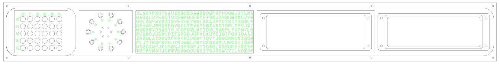

# CNC Files

Depending upon your CNC, and software toolchain, you're likely to have to edit 
these files before you can send anything to your machine.

I cut this out of a maple board, because it's what I had on hand.

The initial dimensions were 5.5" wide, 0.75" thick, and 48" long.

The thickest parts are 0.5", so the first pass is to use a flycutter bit to plane 
down the surface. This makes sure that it's both flat, and the correct thickness.

## Router Bits Used
Bit Type | Bit Diameter | Used For
---------|--------------|---------
Flycutter|2.0"          |Planing board surface to 0.5" and 0.25"
Endmill  |0.125" (1/8") |Cutting small through-holes (LEDs, screw holes)
Endmill  |0.25"  (1/4") |Cutting screw panel depths, cutting out panels
30° V-bit|0.125" (1/8") |Cutting letters (use a sharp bit, go very slowly)
