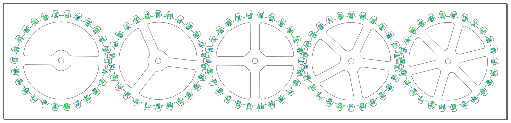

## Cipher Gears

**NOTE:** These gears were generated with the code [here](/Cipher_Gears/Translator/cryptex.py), using a fixed random seed.
If you change the order of the letters by using a different random seed, obviously these 
files will need to be modified before cutting/etching.

### Process
Since these are two-sided gears the order is pretty important:
1. (Optional) Cover both sides of the wood with low-tack painter's tape, or transfer paper to prevent charring
1. Etch one side of the gears (the two sides are different colors/layers)
1. Cut the gear outlines
1. Flip over the gears _without moving the frame from which they've been cut_, and making sure they remain in their same positions
1. Etch the other side of the gears

I used the following laser power/speed settings
* Etch
  * Speed: 400mm/s
  * Power: 18% of 80W machine (15 watts)
* Cut
  * Speed: 15mm/s
  * Power: 70% of 80W machine (56 watts)
