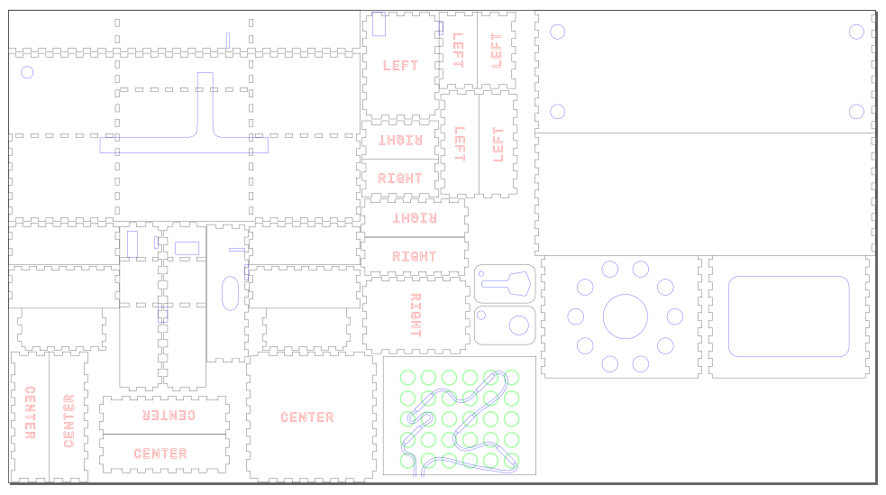

## Drawers and Box Shell

These parts are all laid out on one sheet, but may have to be modified if you have a smaller form-factor laser cutter.

### Process
These pieces are pretty simple to cut and etch. I've made different colors etching, cutting internal holes, and cutting external outlines.

I used the following laser power/speed settings:
* Etch
  * Speed: 300mm/s
  * Power: 18% of 80W machine (15 watts)
* Cut
  * Speed: 15mm/s
  * Power: 40% of 80W machine (32 watts)
